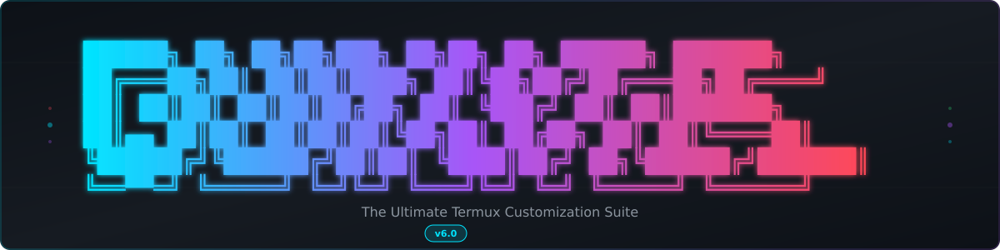
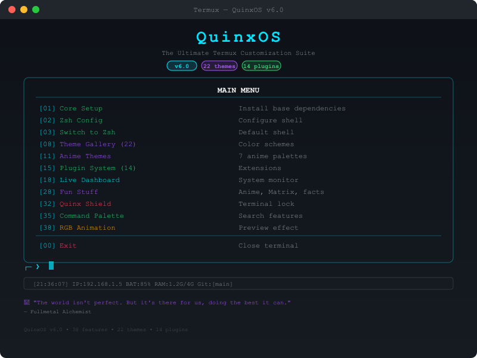
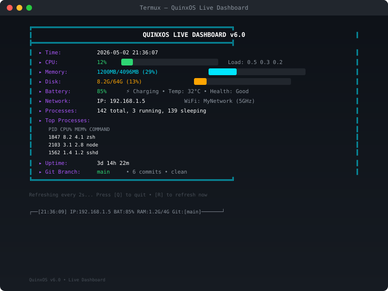
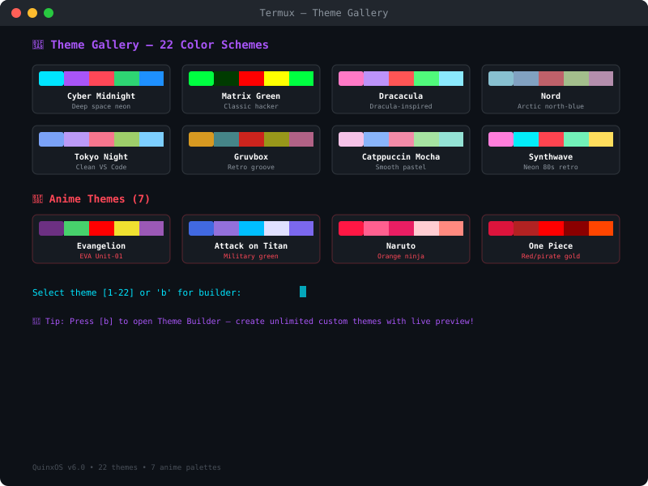
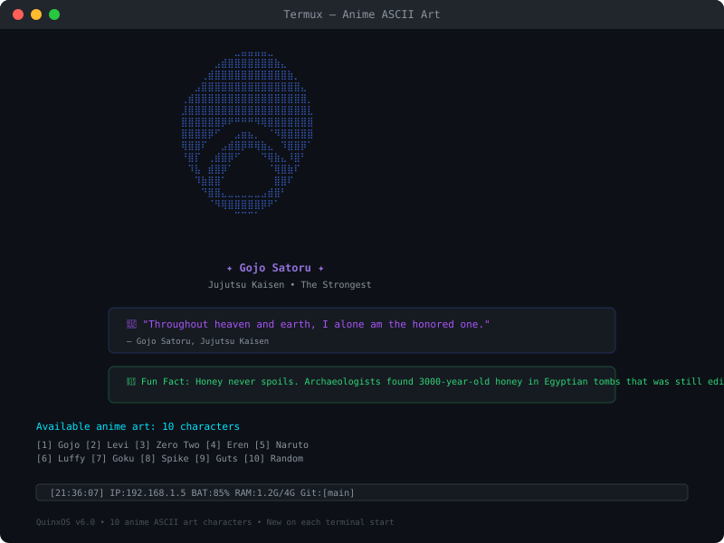
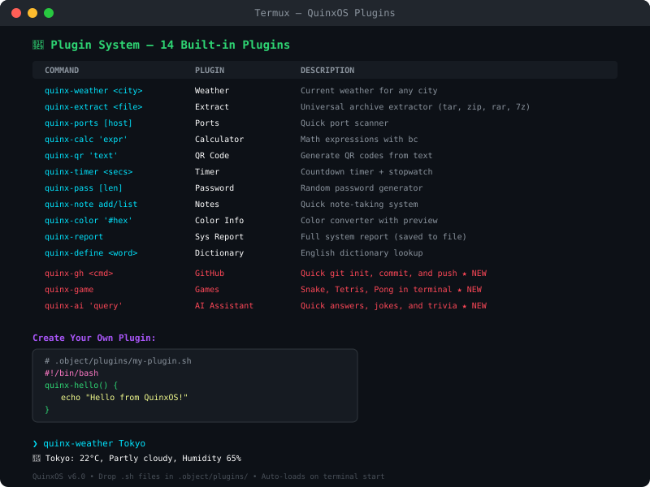

<div align="center">



# **QuinxOS**

### **The Ultimate Termux Customization Suite**

<br>


<br>


<br>

[**📥 Install**](#-installation) &nbsp;|&nbsp; [**🎨 Themes**](#-theme-gallery) &nbsp;|&nbsp; [**🧩 Plugins**](#-plugin-system) &nbsp;|&nbsp; [**📖 Docs**](https://shineii86.github.io/QuinxOS/) &nbsp;|&nbsp; [**🤝 Contribute**](CONTRIBUTING.md) &nbsp;|&nbsp; [**📋 Changelog**](CHANGELOG.md)

</div>

---

## What is QuinxOS?

**QuinxOS** is the most feature-rich terminal optimization and customization suite for **Termux**. It transforms your boring terminal into a polished, secure, and powerful development environment — with **38 menu options**, **22 built-in themes**, a **plugin system**, **live dashboard**, **biometric lock**, **anime art**, and much more.

> One script. One command. Total transformation.

---

## 📸 Screenshots

<div align="center">

### Main Menu


### Live Dashboard


### Theme Gallery (22 themes)


### Anime ASCII Art


### Plugin System (14 plugins)


</div>

---

## ⚡ Quick Start

```bash
pkg update && pkg upgrade -y && pkg install git -y
git clone https://github.com/Shineii86/QuinxOS.git
cd QuinxOS && bash install.sh
```

> 🧙 **First launch?** A guided wizard walks you through shell, theme, banner, and name selection.

---

## 🎯 What's New in v6.0

| Feature | Description |
|:--------|:------------|
| 🎨 **Anime Theme Gallery** | 6 new anime-inspired color schemes — Evangelion, Attack on Titan, Naruto, Dragon Ball, Demon Slayer, One Piece |
| 🖼️ **Anime ASCII Art** | Anime character ASCII banners with random display on terminal start |
| 💬 **Anime Quotes** | Motivational anime quotes shown on each new terminal session |
| 🤓 **Fun Facts** | Random fun facts displayed alongside your daily quote |
| 🐙 **GitHub Integration** | GitHub stats, notifications, streaks, and repo info |
| 🎮 **Matrix Rain** | Matrix-style rain animation in your terminal |
| 🎵 **Anime Plugin** | Anime quotes, waifu art, and ASCII character art |
| ⚙️ **System Tweaks** | Performance optimizations and developer-friendly shell defaults |

### Previous Releases

See [CHANGELOG.md](CHANGELOG.md) for the full version history.

---

## 🎨 Theme Gallery

**22 handcrafted color schemes** — from cyberpunk neon to anime-inspired palettes.

### Classic Themes (16)

| # | Theme | Vibe | # | Theme | Vibe |
|:-:|:------|:-----|:-:|:------|:-----|
| 1 | **Cyber Midnight** | Deep space neon | 9 | **Tokyo Night** | Clean VS Code |
| 2 | **Matrix Green** | Classic hacker | 10 | **Tokyo Day** | Light bright |
| 3 | **Solar Flare** | Warm orange dark | 11 | **Catppuccin Mocha** | Smooth pastel |
| 4 | **Arctic Blue** | Cool ice tones | 12 | **Everforest** | Nature green |
| 5 | **Purple Haze** | Purple magenta | 13 | **Monokai** | Classic editor |
| 6 | **Dracacula** | Dracula-inspired | 14 | **Synthwave** | Neon 80s retro |
| 7 | **Nord** | Arctic north-blue | 15 | **Rosé Pine** | Gentle rose/gold |
| 8 | **Gruvbox** | Retro groove | 16 | **Kanagawa** | Japanese ink |

### Anime Themes (6)

| # | Theme | Inspiration | # | Theme | Inspiration |
|:-:|:------|:------------|:-:|:------|:------------|
| 17 | **Evangelion** | EVA Unit-01 purple/green | 20 | **Dragon Ball** | Orange/blue Saiyan |
| 18 | **Attack on Titan** | Military green/brown | 21 | **Demon Slayer** | Red/black flame |
| 19 | **Naruto** | Orange ninja | 22 | **One Piece** | Red/pirate gold |

> 💡 **Theme Builder** lets you create unlimited custom themes beyond these 22.

---

## 🧩 Plugin System

Drop `.sh` files in `.object/plugins/` — they auto-load on terminal start.

### Built-in Plugins (14)

| Command | Plugin | What It Does |
|:--------|:-------|:-------------|
| `quinx-weather [city]` | Weather | Current weather for any city |
| `quinx-extract <file>` | Extract | Universal archive extractor (tar, zip, rar, 7z, etc.) |
| `quinx-ports [host]` | Ports | Quick port scanner |
| `quinx-calc "expr"` | Calculator | Math expressions with bc |
| `quinx-qr "text"` | QR Code | Generate QR codes from text or URL |
| `quinx-timer [secs]` | Timer | Countdown timer + stopwatch |
| `quinx-pass [len]` | Password | Random password generator |
| `quinx-note [add\|list\|search\|clear]` | Notes | Quick note-taking system |
| `quinx-color [#hex\|name]` | Color Info | Color converter with preview |
| `quinx-report` | Sys Report | Full system report (saved to file) |
| `quinx-define <word>` | Dictionary | English dictionary lookup |
| `quinx-anime-quote` | Anime | Anime quotes, waifu art, ASCII art |
| `quinx-matrix [secs]` | Matrix | Matrix rain animation in terminal |
| `quinx-ghstats` | GitHub | GitHub stats, notifications, streaks, repos |

### Creating Your Own

```bash
# .object/plugins/my-plugin.sh
#!/bin/bash
quinx-hello() {
    echo "Hello from QuinxOS!"
}
```

Restart terminal → `quinx-hello` works immediately.

---

## 📌 Persistent Header

After pressing `clear`, you still see your system status:

```
┌──[14:32:07] IP:192.168.1.5 BAT:85% RAM:1.2G/4G Git:[main]───────┘
```

Time, IP address, battery, RAM usage, and git branch — always visible.

---

## 🖥️ Live Dashboard

Full-screen real-time system monitor (refreshes every 2 seconds):

```
╔══════════════════════════════════════════════════════════╗
║              QUINXOS LIVE DASHBOARD v6.0                 ║
╠══════════════════════════════════════════════════════════╣
║  ▸ Time:      2026-05-02 14:32:07                       ║
║  ▸ CPU:       12%   Load: 0.5 0.3 0.2                   ║
║  ▸ Memory:    1200MB/4096MB (29%)                        ║
║  ▸ Disk:      8.2G/64G (13%)                            ║
║  ▸ Battery:   85%                                        ║
║  ▸ Network:   IP: 192.168.1.5                           ║
╚══════════════════════════════════════════════════════════╝
```

---

## 📡 Termux API Integration

Requires `pkg install termux-api` + [Termux:API app](https://f-droid.org/packages/com.termux.api/).

| Hook | What It Does |
|:-----|:-------------|
| Battery Status | Show charge level, temperature, health |
| GPS Location | Latitude, longitude, altitude, accuracy |
| Notifications | List device notifications |
| Clipboard | Get/set clipboard contents |
| Torch | Toggle flashlight on/off |
| Vibrate | Vibrate the device |

---

## 📦 Color Export

Export any QuinxOS theme to work in other terminals:

| Format | Terminal |
|:-------|:---------|
| JSON | Windows Terminal |
| PLIST | iTerm2 (macOS) |
| YAML | Alacritty |
| CONF | Kitty |

---

## 📋 All Features

| # | Feature | # | Feature |
|:-:|:--------|:-:|:--------|
| 01 | Core Setup | 20 | GitHub Integration |
| 02 | Zsh Config | 21 | System Info |
| 03 | Switch → Zsh | 22 | Network Info |
| 04 | Switch → Bash | 23 | QuinxBench |
| 05 | Banner Style (5) | 24 | Neofetch Banner |
| 06 | Custom Theme | 25 | Profile System |
| 07 | Zsh Plugins | 26 | Dotfiles Sync |
| 08 | Theme Gallery (22) | 27 | Termux API Hooks |
| 09 | Theme Builder | 28 | Fun Stuff |
| 10 | Color Export | 29 | MOTD Editor |
| 11 | Anime Themes (6) | 30 | Backup/Restore |
| 12 | Dev Tools | 31 | Startup Timer |
| 13 | Quick Commands | 32 | Quinx Shield |
| 14 | Aliases Manager | 33 | Fingerprint Lock |
| 15 | Plugin System | 34 | Remove Lock |
| 16 | Custom ASCII Art | 35 | Command Palette |
| 17 | Login Sound | 36 | Update QuinxOS |
| 18 | Live Dashboard | 37 | Uninstall |
| 19 | Git Dashboard | 38 | RGB Animation |

---

## 🛠️ Dev Tools Installer

One-click installation for popular development tools:

| Tool | Includes | Tool | Includes |
|:-----|:---------|:-----|:---------|
| **Python 3** | pip, ipython, virtualenv | **Go** | golang compiler |
| **Node.js** | npm, yarn | **Rust** | cargo, rustc |
| **Ruby** | gem, bundler | **PHP** | php |
| **Git + SSH** | git, openssh | **Neovim** | Modern editor |
| **tmux** | Terminal multiplexer | **Stacks** | All Python, All Web |

---

## ⚡ Quick Commands

Common operations without leaving QuinxOS:

- **Git Init + Push** — Initialize and push a new repo
- **Compress Folder** — Create .tar.gz archive
- **Find Large Files** — Top 10 biggest files on disk
- **Kill Port** — Kill process on any port
- **HTTP Serve** — Start local web server
- **SSH Keygen** — Generate ed25519 keypair
- **Process Monitor** — Top processes by CPU
- **WiFi Info** — Network details

---

## 🔒 Security Features

### Quinx Shield
Encrypted terminal lock with:
- 3-attempt lockout with session termination
- Auto-generated 16-char recovery key
- Standalone `quinx-unlock` script
- Recovery options after lockout

### Fingerprint Lock
Biometric authentication using Termux API — no passwords needed.

---

## 👤 Profile System

Switch between different configurations instantly:

- **Work** — Clean theme, dev aliases, Python plugins
- **Personal** — Neon theme, custom banner, all plugins
- **Hacking** — Matrix Green, security tools, OSINT plugins

Each profile stores: theme, banner, aliases, zshrc, plugins.

---

## 🗑️ Uninstall

To completely remove QuinxOS from your system:

1. Open QuinxOS → Select **[37] Uninstall** from the menu
2. Or run manually:
   ```bash
   cd ~/QuinxOS && bash install.sh --skip-wizard
   # Then select option 37
   ```

**What gets removed:**
- `~/QuinxOS/` directory (themes, plugins, configs)
- QuinxOS shell configuration from `.zshrc` / `.bashrc`
- QuinxOS aliases and functions
- `.quinx-installed` marker file

**What is preserved:**
- Your original `.zshrc` / `.bashrc` backup (if created during install)
- Termux itself and any manually installed packages

---

## 🤝 Contributing

We love contributions! Whether it's a new theme, plugin, bug fix, or documentation improvement — every bit helps.

See [CONTRIBUTING.md](CONTRIBUTING.md) for detailed guidelines.

### Quick Start

1. **Fork** → **Clone** → **Branch** (`git checkout -b feature/amazing`)
2. Make your changes
3. **Commit** (`git commit -m 'feat: add amazing feature'`)
4. **Push** (`git push origin feature/amazing`)
5. Open a **Pull Request**

---

## 📊 Project Stats

| Metric | Value |
|:-------|:------|
| Menu Options | 38 |
| Color Themes | 22 |
| Built-in Plugins | 14 |
| Shell Supported | Zsh + Bash |
| Install Script | ~2,000+ lines |
| Dependencies | Pure Bash (no Python/Node required for core) |
| Anime ASCII Art | 10 characters |
| Anime Themes | 6 palettes |

---

## ⭐ Star History

<a href="https://star-history.com/#Shineii86/QuinxOS&Date">
 <picture>
   <source media="(prefers-color-scheme: dark)" srcset="https://api.star-history.com/svg?repos=Shineii86/QuinxOS&type=Date&theme=dark" />
   <source media="(prefers-color-scheme: light)" srcset="https://api.star-history.com/svg?repos=Shineii86/QuinxOS&type=Date" />
   
 </picture>
</a>

---

## 🧩 Writing Plugins

Want to create your own QuinxOS plugin? See the [Plugin API Guide](plugins/README.md) for documentation, environment variables, helper functions, and examples.

---

## 🙏 Credits

- [Oh My Zsh](https://ohmyz.sh/) — Zsh framework
- [Termux](https://termux.dev/) — Android terminal emulator
- Original concept: [Termux-OS](https://github.com/h4ck3r0/Termux-os) by H4CK3R
- Built with ❤️ by **[Shineii86](https://github.com/Shineii86)**

---

## 📄 License

This project is licensed under the **GNU General Public License v3.0** — see the [LICENSE](LICENSE) file for details.

---

<div align="center">

**[⬆ Back to Top](#quinxos)**

<br>

<a href="https://github.com/Shineii86/QuinxOS">

</a>

<br>

<sub>Built for Termux • Powered by Bash • Made by Shineii86</sub>

</div>
